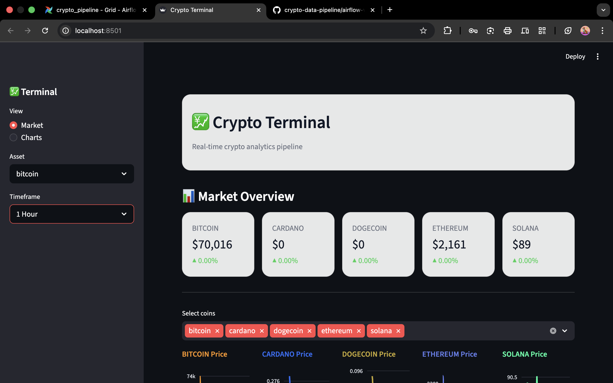
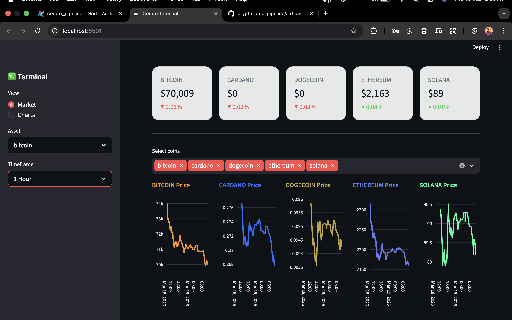
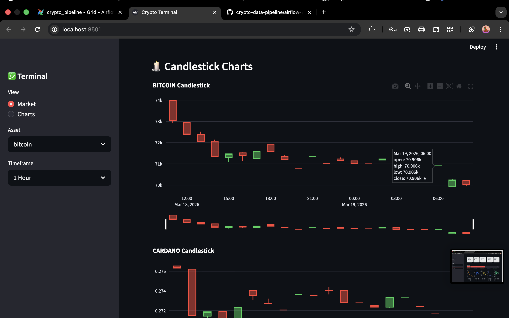
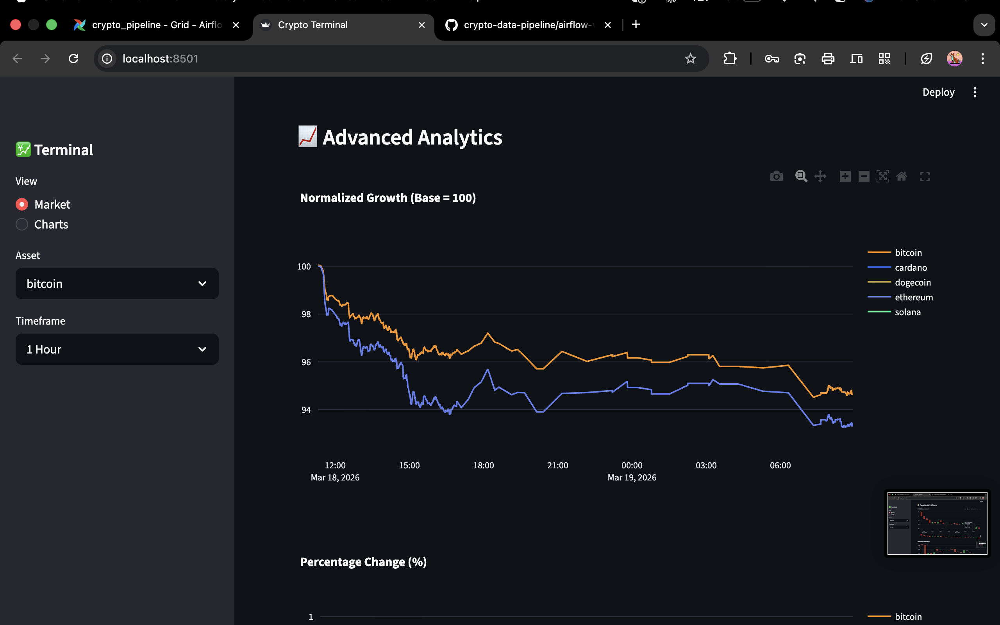
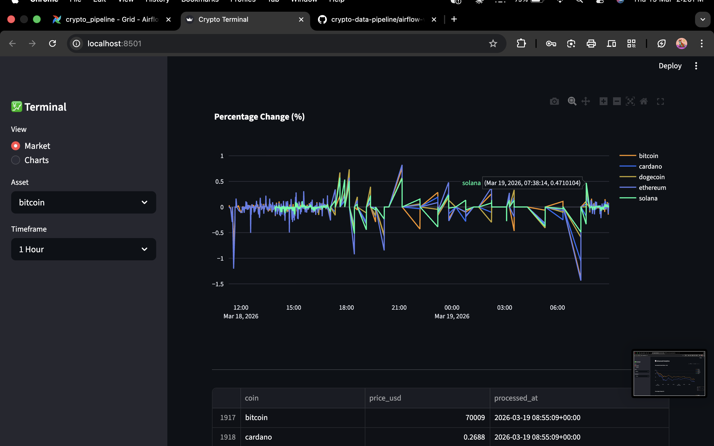

⸻

:::writing{variant=“standard” id=“91827”}

🚀 CryptoFlux Terminal

Real-Time Crypto Data Pipeline & Analytics Dashboard

⸻

📌 Overview

CryptoFlux Terminal is an end-to-end real-time data engineering project designed to ingest, process, and visualize cryptocurrency data using a production-style pipeline.

⸻

⚙️ Architecture

API → Airflow → PostgreSQL → Streamlit
	•	Data is fetched from crypto APIs
	•	Orchestrated using Apache Airflow DAGs
	•	Stored in PostgreSQL database (airflow)
	•	Visualized through an interactive Streamlit dashboard

⸻

🧰 Tech Stack
	•	Python
	•	Apache Airflow
	•	PostgreSQL
	•	Streamlit
	•	Plotly

⸻

📊 Features
	•	Real-time crypto data ingestion
	•	Automated ETL pipeline using Airflow
	•	Multi-coin tracking (BTC, ETH, ADA, SOL, DOGE)
	•	Interactive dashboard (Trading Terminal UI)
	•	Candlestick charts using OHLC aggregation
	•	Normalized growth analysis
	•	Percentage change analytics
	•	Asset & timeframe selection

⸻

📸 Dashboard Preview

⸻

🚀 How to Run

# Start Airflow & PostgreSQL
docker-compose up

# Run pipeline manually (optional)
python run_pipeline.py

# Start dashboard
streamlit run dashboard.py

⸻

💡 Key Learning

Built a scalable real-time data pipeline integrating orchestration (Airflow), storage (PostgreSQL), and visualization (Streamlit), following a production-style architecture.

